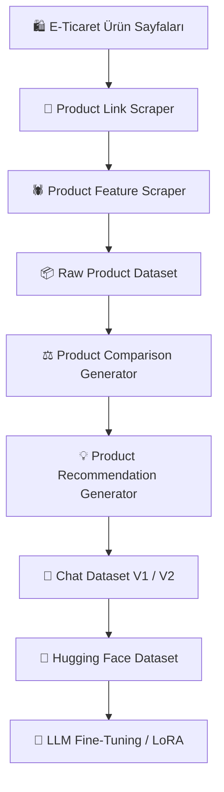

<div align="center">

# 🛍️ Turkish E-Commerce Product Comparison & Recommendation

### Web Scraping → Dataset Generation → LLM Fine-Tuning

Türkçe elektronik ürün karşılaştırma ve öneri sistemleri için hazırlanmış  
uçtan uca bir **web scraping ve LLM dataset oluşturma pipeline'ı**.

<br>

[](https://huggingface.co/datasets/sedayzc/turkish-electronics-product-comparison-recommendation)
[](https://huggingface.co/datasets/sedayzc/trendyol-electronics-products-features-and-comments)
[](https://www.python.org/)
[](https://www.selenium.dev/)
[](#)
[](#lisans-ve-kullanım-notu)

<br>

**6,886 Türkçe Chat Örneği (V2)** • **491 İşlenmiş Ürün** • **4,851 Comparison** • **2,035 Recommendation**

</div>

---

## 📌 Proje Hakkında

Bu proje, elektronik ürün bilgilerini web scraping yöntemiyle toplayarak
Türkçe **ürün karşılaştırma** ve **ürün öneri** görevleri için chat tabanlı
bir LLM fine-tuning veri seti oluşturmayı amaçlamaktadır.

Proje kapsamında:

- 🕷️ Elektronik ürün bağlantıları otomatik olarak toplandı.
- 📦 Ürün özellikleri ve kullanıcı değerlendirmeleri scrape edildi.
- 🔍 Benzer ürünler otomatik olarak eşleştirildi.
- ⚖️ Ürün karşılaştırma soru-cevapları oluşturuldu.
- 💡 Ürün öneri soru-cevapları oluşturuldu.
- 💬 Veriler LLM uyumlu chat formatına dönüştürüldü.
- 🔄 Recommendation dataset V2 ile öneri senaryoları genişletildi.
- 🤗 Oluşturulan veri setleri Hugging Face Hub üzerinde yayınlandı.
- 🧠 Güncel V2 dataset, Qwen3-1.7B modelinin LoRA fine-tuning sürecinde kullanıldı.

---

# 🔄 Pipeline



---

# 📂 Proje Yapısı

```text
ecommerce-product-comparison-recommendation/
│
├── scraping/
│   ├── README.md
│   ├── product-links-scraper.py
│   └── products-feature-scraper.py
│
├── create_comparison_chat_dataset.py
├── add_recommendation_dataset.py
│
├── comparison_chat_dataset.json
├── recommendation_chat_dataset.json
├── recommendation_chat_dataset_v2.json
│
├── README.md
└── .gitignore
```

Dataset oluşturma script'leri ve üretilen chat dataset sürümleri bu repository
içerisinde yer almaktadır.

Ham scraping sonucunda oluşturulan ürün dataset'i ayrıca Hugging Face Hub
üzerinde ayrı bir dataset repository'sinde yayınlanmaktadır.

Chat dataset'in V1 ve V2 sürümleri de Hugging Face Hub üzerinden erişilebilir
durumdadır.

---

# 🕷️ Web Scraping Pipeline

Web scraping pipeline'ı iki temel aşamadan oluşmaktadır.

## 1️⃣ Ürün Linklerinin Toplanması

```text
scraping/product-links-scraper.py
```

Listeleme sayfasındaki ürün kartları dinamik olarak yüklenmektedir.
Script, kademeli scroll işlemleri uygulayarak yeni ürünlerin yüklenmesini
bekler ve ürün bağlantılarını otomatik olarak toplar.

Ürünler mümkün olduğunda:

```text
product_id + merchant_id
```

kombinasyonuna göre değerlendirilir.

Böylece aynı ürün farklı bir satıcı tarafından sunuluyorsa ayrı bir ürün
teklifi olarak işlenebilir.

## 2️⃣ Ürün Bilgilerinin Toplanması

```text
scraping/products-feature-scraper.py
```

Toplanan ürün URL'leri tek tek ziyaret edilerek erişilebilir ürün bilgileri
çıkarılır.

Toplanan bilgiler arasında:

| Alan | Açıklama |
|---|---|
| 🏷️ Ürün Adı | Ürünün tam adı |
| 🏢 Marka | Ürün markası |
| 💰 Fiyat | Scraping anındaki fiyat |
| ⭐ Kullanıcı Puanı | Genel yıldız puanı |
| 📊 Değerlendirme Sayısı | Toplam değerlendirme |
| 💬 Yorumlar | Kullanıcı yorumları |
| 🗂️ Kategori | Ürün kategori hiyerarşisi |
| ⚙️ Teknik Özellikler | Ürüne ait teknik özellikler |
| 🔗 URL | Kaynak ürün bağlantısı |
| 🏪 Merchant ID | Satıcı kimliği |

bulunmaktadır.

Detaylı scraping dokümantasyonu:

➡️ [`scraping/README.md`](scraping/README.md)

---

# 📦 Dataset Oluşturma

Ham scraping verileri doğrudan fine-tuning amacıyla kullanılmamıştır.

Toplanan ürün verileri, ürün karşılaştırma ve ürün öneri görevlerini içeren
chat formatına dönüştürülmüştür.

---

# ⚖️ Product Comparison Dataset

```text
create_comparison_chat_dataset.py
```

Benzer kategorideki ürünler teknik özellik benzerlikleri dikkate alınarak
otomatik olarak eşleştirilmiştir.

Oluşturulan görev türleri:

- ⚖️ Genel ürün karşılaştırması
- 💰 Fiyat karşılaştırması
- ⚙️ Teknik özellik karşılaştırması
- ⭐ Kullanıcı puanı karşılaştırması
- 📊 Değerlendirme karşılaştırması
- 💬 Kullanıcı yorumu karşılaştırması

### Örnek

```json
{
  "messages": [
    {
      "role": "user",
      "content": "HP Victus ile Lenovo LOQ modellerini teknik özellikler açısından karşılaştırır mısın?"
    },
    {
      "role": "assistant",
      "content": "HP Victus ve Lenovo LOQ modelleri teknik özellikler açısından karşılaştırıldığında..."
    }
  ]
}
```

Comparison aşamasında toplam:

```text
4,851 chat örneği
```

oluşturulmuştur.

Bu aşamada oluşturulan ara dataset:

```text
comparison_chat_dataset.json
```

---

# 💡 Product Recommendation Dataset

```text
add_recommendation_dataset.py
```

Product Comparison Dataset üzerine ürün öneri görevleri eklenerek
Product Comparison & Recommendation Chat Dataset oluşturulmuştur.

Dataset'in ilk sürümü olan **V1**, temel ürün öneri senaryolarını içerirken,
**V2 sürümünde recommendation örnekleri genişletilmiş ve çeşitlendirilmiştir**.

Recommendation dataset aşağıdaki gibi farklı öneri senaryolarını içermektedir:

- 💸 Fiyat-performans odaklı ürün önerisi
- 💳 Bütçe bazlı ürün önerisi
- ⭐ Kullanıcı puanı bazlı ürün önerisi
- 📊 Değerlendirme sayısı bazlı ürün önerisi
- 🏷️ Marka bazlı ürün önerisi
- 💻 Kategori bazlı ürün önerisi
- 💡 Genel elektronik ürün önerisi
- 🔄 Alternatif ürün önerisi

### Örnek

```json
{
  "messages": [
    {
      "role": "user",
      "content": "Fiyat performans açısından hangi Laptop modelini önerirsin?"
    },
    {
      "role": "assistant",
      "content": "LENOVO NB V15 82YU0123TX RYZEN 5 7520U 16GB 512SSD O/B 15.6 DOS öne çıkıyor. LENOVO NB V15 82YU0123TX RYZEN 5 7520U 16GB 512SSD O/B 15.6 DOS, 25.999,00 TL, 4.5 puan, 726 değerlendirme. Öneri fiyat, kullanıcı puanı, değerlendirme sayısı ve mevcut teknik özellikler birlikte dikkate alınarak yapılmıştır."
    }
  ]
}
```

V2 Recommendation Dataset oluşturma sonucunda:

```text
2,035 recommendation chat örneği
```

elde edilmiştir.

Bu recommendation örnekleri mevcut **4,851 product comparison** örneğiyle
birleştirilerek toplam **6,886 chat örneğinden** oluşan V2 dataset
oluşturulmuştur.

---

# 📊 Dataset İstatistikleri

Dataset'in iki farklı sürümü bulunmaktadır.

| Dataset | Comparison | Recommendation | Toplam |
|---|---:|---:|---:|
| V1 | 4,851 | 121 | 4,972 |
| V2 | 4,851 | 2,035 | **6,886** |

Ham scraping pipeline'ında başarıyla işlenen toplam ürün sayısı:

```text
491 ürün
```

## V1

İlk sürüm, Product Comparison Dataset üzerine temel recommendation
örneklerinin eklenmesiyle oluşturulmuştur.

```text
recommendation_chat_dataset.json
```

Toplam:

```text
4,972 chat örneği
```

içermektedir.

## V2

V2 sürümünde recommendation örnekleri genişletilmiş ve daha çeşitli
ürün öneri senaryoları eklenmiştir.

```text
recommendation_chat_dataset_v2.json
```

Dataset dağılımı:

```text
Product Comparison     : 4,851
Product Recommendation : 2,035
--------------------------------
Total                   : 6,886
```

LLM fine-tuning çalışmalarında kullanılan güncel dataset sürümü **V2**'dir.

---

# 🤗 Hugging Face Datasets

## 📦 Raw Electronics Product Dataset

Ham scraping sonucunda oluşturulan elektronik ürün dataset'i:

[](https://huggingface.co/datasets/sedayzc/trendyol-electronics-products-features-and-comments)

```text
sedayzc/trendyol-electronics-products-features-and-comments
```

---

## 💬 Product Comparison & Recommendation Chat Dataset

LLM fine-tuning için hazırlanmış chat dataset:

[](https://huggingface.co/datasets/sedayzc/turkish-electronics-product-comparison-recommendation)

```text
sedayzc/turkish-electronics-product-comparison-recommendation
```

Hugging Face dataset repository'sinde V1 ve V2 olmak üzere iki dataset
dosyası bulunmaktadır:

| Sürüm | Hugging Face Dosyası | Açıklama |
|---|---|---|
| V1 | `data/recommendation_chat_dataset.json` | İlk Product Comparison + Recommendation Chat Dataset |
| V2 | `data/recommendation_chat_dataset_v2.json` | Recommendation örnekleri genişletilmiş güncel dataset |

Qwen3-1.7B LoRA fine-tuning çalışmasında **V2 dataset** kullanılmıştır.

Python ile dataset repository'sini yüklemek için:

```python
from datasets import load_dataset

dataset = load_dataset(
    "sedayzc/turkish-electronics-product-comparison-recommendation"
)

print(dataset)
```

---

# 💬 Chat Dataset Formatı

Dataset, LLM Supervised Fine-Tuning (SFT) ve instruction tuning
çalışmalarında kullanılabilecek `messages` formatında hazırlanmıştır.

Her kayıt bir kullanıcı ve asistan mesajından oluşmaktadır:

```json
{
  "messages": [
    {
      "role": "user",
      "content": "Kullanıcı sorusu"
    },
    {
      "role": "assistant",
      "content": "Asistan cevabı"
    }
  ]
}
```

Dataset içerisinde gereksiz `null` alanlar tutulmamaktadır.

---

# 🧠 LLM Fine-Tuning

Dataset'in V2 sürümü, **Qwen3-1.7B** modelinin Türkçe elektronik ürün
karşılaştırma ve öneri görevlerine adapte edilmesi amacıyla LoRA yöntemiyle
fine-tune edilmesinde kullanılmıştır.

Fine-tuning sürecinde:

- **Base Model:** Qwen3-1.7B
- **Method:** LoRA (Low-Rank Adaptation)
- **Training:** Supervised Fine-Tuning (SFT)
- **Framework:** Unsloth + TRL
- **Dataset:** Recommendation Chat Dataset V2
- **Training Samples:** 6,886 chat örneği

kullanılmıştır.

Fine-tune edilen LoRA adapter Hugging Face Hub üzerinde yayınlanmıştır:

[](https://huggingface.co/sedayzc/qwen3-1.7b-turkish-electronics-lora-v2)

---

# 🛠️ Kullanılan Teknolojiler

| Teknoloji | Kullanım |
|---|---|
| Python | Ana geliştirme dili |
| Selenium | Dinamik web scraping |
| BeautifulSoup | HTML parsing |
| Pandas | Veri işleme |
| JSON / JSONL | Dataset formatları |
| Hugging Face | Dataset ve model hosting |
| Unsloth | LLM fine-tuning |
| TRL | Supervised Fine-Tuning |
| LoRA / PEFT | Parameter-efficient fine-tuning |

---

# 🚀 Kullanım

Repository'yi klonlayın:

```bash
git clone https://github.com/ssedayzc/ecommerce-product-comparison-recommendation.git
```

Proje dizinine geçin:

```bash
cd ecommerce-product-comparison-recommendation
```

Gerekli paketleri yükleyin:

```bash
pip install selenium webdriver-manager beautifulsoup4 pandas openpyxl
```

Ürün listesi bağlantılarını toplamak için:

```bash
python scraping/product-links-scraper.py
```

Ürün bilgilerini toplamak için:

```bash
python scraping/products-feature-scraper.py
```

Product Comparison Dataset oluşturmak için:

```bash
python create_comparison_chat_dataset.py
```

Product Recommendation örneklerini ekleyerek güncel V2 dataset'i oluşturmak için:

```bash
python add_recommendation_dataset.py
```

Oluşturulan V2 dataset:

```text
recommendation_chat_dataset_v2.json
```

---

# 📜 Lisans ve Kullanım Notu

Veriler eğitim ve araştırma amacıyla herkese açık e-ticaret sayfalarından
elde edilmiştir.

Bu proje **Trendyol tarafından oluşturulmamış, desteklenmemiş veya
onaylanmamıştır**.


---
