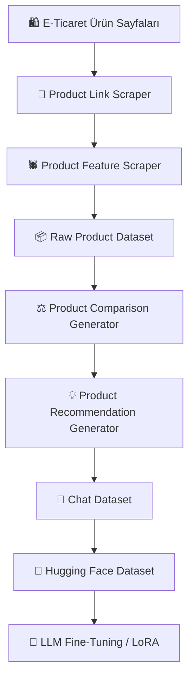

<div align="center">

# 🛍️ Turkish E-Commerce Product Comparison & Recommendation

### Web Scraping → Dataset Generation → LLM Fine-Tuning

Türkçe elektronik ürün karşılaştırma ve öneri sistemleri için hazırlanmış  
uçtan uca bir **web scraping ve LLM dataset oluşturma pipeline'ı**.

<br>

[](https://huggingface.co/datasets/sedayzc/turkish-electronics-product-comparison-recommendation)
[](https://huggingface.co/datasets/sedayzc/trendyol-electronics-products)
[](https://www.python.org/)
[](https://www.selenium.dev/)
[](#)
[](#lisans-ve-kullanım-notu)

<br>

**4,972 Türkçe Chat Örneği** • **491 İşlenmiş Ürün** • **Comparison + Recommendation**

</div>

---

## 📌 Proje Hakkında

Bu proje, elektronik ürün bilgilerini web scraping yöntemiyle toplayarak
Türkçe **ürün karşılaştırma** ve **ürün öneri** görevleri için chat tabanlı
bir LLM fine-tuning veri seti oluşturmayı amaçlamaktadır.

Proje kapsamında:

- 🕷️ Elektronik ürün bağlantıları otomatik olarak toplandı.
- 📦 Ürün özellikleri ve kullanıcı değerlendirmeleri scrape edildi.
- 🔍 Benzer ürünler otomatik olarak eşleştirildi.
- ⚖️ Ürün karşılaştırma soru-cevapları oluşturuldu.
- 💡 Ürün öneri soru-cevapları oluşturuldu.
- 💬 Veriler LLM uyumlu chat formatına dönüştürüldü.
- 🤗 Oluşturulan veri setleri Hugging Face Hub üzerinde yayınlandı.

---

# 🔄 Pipeline



---

# 📂 Proje Yapısı

```text
ecommerce-product-comparison-recommendation/
│
├── scraping/
│   ├── README.md
│   ├── product-links-scraper.py
│   └── products-feature-scraper.py
│
├── create_comparison_chat_dataset.py
├── add_recommendation_dataset.py
│
├── README.md
└── .gitignore
```

Oluşturulan ham ve işlenmiş dataset dosyaları GitHub repository'sine
eklenmemektedir. Veri setleri Hugging Face Hub üzerinde ayrı olarak
yayınlanmaktadır.

---

# 🕷️ Web Scraping Pipeline

Web scraping pipeline'ı iki temel aşamadan oluşmaktadır.

### 1️⃣ Ürün Linklerinin Toplanması

```text
scraping/product-links-scraper.py
```

Listeleme sayfasındaki ürün kartları dinamik olarak yüklenmektedir.
Script, kademeli scroll işlemleri uygulayarak yeni ürünlerin yüklenmesini
bekler ve ürün bağlantılarını otomatik olarak toplar.

Ürünler mümkün olduğunda:

```text
product_id + merchant_id
```

kombinasyonuna göre değerlendirilir.

Böylece aynı ürün farklı bir satıcı tarafından sunuluyorsa ayrı bir ürün
teklifi olarak işlenebilir.

### 2️⃣ Ürün Bilgilerinin Toplanması

```text
scraping/products-feature-scraper.py
```

Toplanan ürün URL'leri tek tek ziyaret edilerek erişilebilir ürün bilgileri
çıkarılır.

Toplanan bilgiler arasında:

| Alan | Açıklama |
|---|---|
| 🏷️ Ürün Adı | Ürünün tam adı |
| 🏢 Marka | Ürün markası |
| 💰 Fiyat | Scraping anındaki fiyat |
| ⭐ Kullanıcı Puanı | Genel yıldız puanı |
| 📊 Değerlendirme Sayısı | Toplam değerlendirme |
| 💬 Yorumlar | Kullanıcı yorumları |
| 🗂️ Kategori | Ürün kategori hiyerarşisi |
| ⚙️ Teknik Özellikler | Ürüne ait teknik özellikler |
| 🔗 URL | Kaynak ürün bağlantısı |
| 🏪 Merchant ID | Satıcı kimliği |

bulunmaktadır.

Detaylı scraping dokümantasyonu:

➡️ [`scraping/README.md`](scraping/README.md)

---

# 📦 Dataset Oluşturma

Ham scraping verileri doğrudan fine-tuning amacıyla kullanılmamıştır.

Ürün verileri iki aşamada chat formatına dönüştürülmüştür.

## ⚖️ Product Comparison Dataset

```text
create_comparison_chat_dataset.py
```

Benzer kategorideki ürünler teknik özellik benzerlikleri dikkate alınarak
otomatik olarak eşleştirilmiştir.

Oluşturulan görev türleri:

- ⚖️ Genel ürün karşılaştırması
- 💰 Fiyat karşılaştırması
- ⚙️ Teknik özellik karşılaştırması
- ⭐ Kullanıcı puanı karşılaştırması
- 📊 Değerlendirme karşılaştırması
- 💬 Kullanıcı yorumu karşılaştırması

### Örnek

```json
{
  "messages": [
    {
      "role": "user",
      "content": "HP Victus ile Lenovo LOQ modellerini teknik özellikler açısından karşılaştırır mısın?"
    },
    {
      "role": "assistant",
      "content": "HP Victus ve Lenovo LOQ modelleri teknik özellikler açısından karşılaştırıldığında..."
    }
  ]
}
```

Comparison aşamasında toplam:

```text
4,851 chat örneği
```

oluşturulmuştur.

---

# 💡 Product Recommendation Dataset

```text
add_recommendation_dataset.py
```

Comparison dataset üzerine ürün öneri görevleri eklenmiştir.

Ürünler:

```text
marka + kategori
```

bazında gruplanarak öneriler oluşturulmuştur.

Dataset şu öneri görevlerini içermektedir:

- 💸 Fiyat-performans ürünü önerisi
- 💳 Bütçe bazlı ürün önerisi
- ⭐ En yüksek puanlı ürün önerisi
- 🏷️ En uygun fiyatlı ürün önerisi

### Örnek

```json
{
  "messages": [
    {
      "role": "user",
      "content": "En iyi fiyat performans Lenovo laptop önerisinde bulun."
    },
    {
      "role": "assistant",
      "content": "Veri setindeki Lenovo laptop modelleri fiyat, kullanıcı puanı, değerlendirme sayısı ve teknik özellik doluluğu birlikte değerlendirildiğinde..."
    }
  ]
}
```

Recommendation aşamasında:

```text
121 yeni chat örneği
```

oluşturulmuştur.

---

# 📊 Dataset İstatistikleri

| Dataset | Kayıt |
|---|---:|
| Başarılı işlenen ürün | 491 |
| Comparison örneği | 4,851 |
| Recommendation örneği | 121 |
| **Final Chat Dataset** | **4,972** |

Final dataset hem **ürün karşılaştırma** hem de **ürün öneri** görevlerini
aynı veri setinde içermektedir.

---

# 🤗 Hugging Face Datasets

## 📦 Raw Electronics Product Dataset

Ham scraping sonucunda oluşturulan elektronik ürün dataset'i:

[](https://huggingface.co/datasets/sedayzc/trendyol-electronics-products-features-and-comments)

```text
ssedayzc/trendyol-electronics-products-features-and-comments
```

---

## 💬 Product Comparison & Recommendation Chat Dataset

LLM fine-tuning için hazırlanmış final dataset:

[](https://huggingface.co/datasets/sedayzc/turkish-electronics-product-comparison-recommendation)

```text
sedayzc/turkish-electronics-product-comparison-recommendation
```

Python ile yüklemek için:

```python
from datasets import load_dataset

dataset = load_dataset(
    "sedayzc/turkish-electronics-product-comparison-recommendation"
)

print(dataset)
```

---

# 💬 Chat Dataset Formatı

Final dataset LLM fine-tuning için yaygın olarak kullanılan `messages`
formatında hazırlanmıştır.

```json
{
  "messages": [
    {
      "role": "user",
      "content": "Kullanıcı sorusu"
    },
    {
      "role": "assistant",
      "content": "Asistan cevabı"
    }
  ]
}
```

Dataset içerisinde gereksiz `null` alanlar tutulmamaktadır.

---

<br>

| Teknoloji | Kullanım |
|---|---|
| Python | Ana geliştirme dili |
| Selenium | Dinamik web scraping |
| BeautifulSoup | HTML parsing |
| Pandas | Veri işleme |
| JSON / JSONL | Dataset formatları |
| Hugging Face | Dataset hosting |
| Unsloth | LLM fine-tuning |
| LoRA / PEFT | Parameter-efficient fine-tuning |

---

# 🚀 Kullanım

```bash
git clone https://github.com/ssedayzc/ecommerce-product-comparison-recommendation.git
```

Gerekli paketleri yükleyin:

```bash
pip install selenium webdriver-manager beautifulsoup4 pandas openpyxl
```

Özellikleri toplanacak ürün listesi linklerini toplayın:

```bash
python product-links-scraper.py
```

Ürün bilgilerini toplayın:

```bash
python products-feature-scraper.py
```

Ürün karşılaştırma dataseti oluşturun:

```bash
python create_comparison_chat_dataset.py
```

Ürün öneri datasetini ekleyin:

```bash
python add_recommendation_dataset.py
```
---


# 📜 Lisans ve Kullanım Notu

Veriler eğitim ve araştırma amacıyla herkese açık e-ticaret sayfalarından
elde edilmiştir.

Bu proje **Trendyol tarafından oluşturulmamış, desteklenmemiş veya
onaylanmamıştır**.

Trendyol adı ve dataset içerisinde bulunan marka ve ürün adları ilgili hak
sahiplerine aittir.

Dataset ve kodları kullanan kişiler ilgili platform koşullarına ve
uygulanabilir yasal gerekliliklere uygunluğu değerlendirmekten sorumludur.

---

<div align="center">

## 👩‍💻 Author

**Seda Nur Yazıcı**

[](https://github.com/ssedayzc)
[](https://huggingface.co/sedayzc)

<br>


</div>